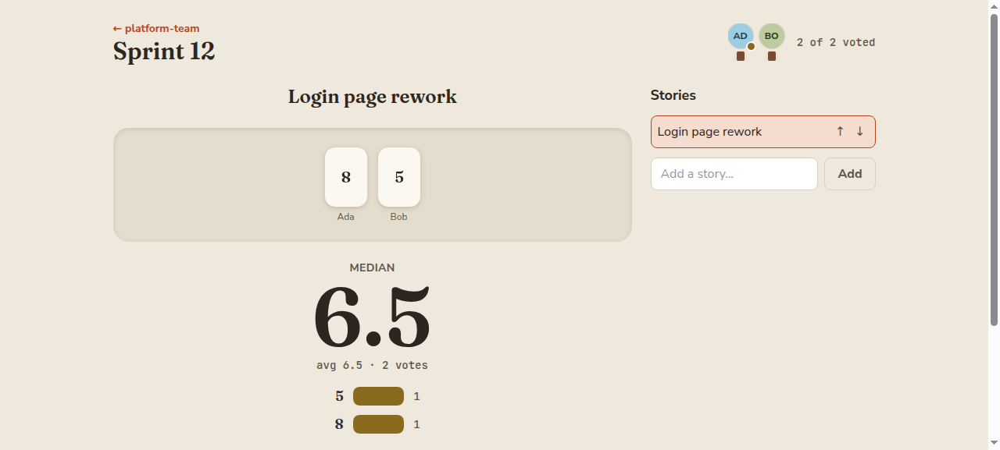

# Parley

Planning poker and daily standups for your team, at your table. Self-hosted,
open source, no accounts, no fuss.



- **Planning poker** — story queue, four deck presets, hidden votes with
  auto-reveal, a proper histogram with per-deck stats (T-shirt decks get
  mode/range, never a meaningless average), CSV export.
- **Daily standup** — round-robin speaking order with a per-person timer,
  skip/absent, yesterday's "today" carried forward automatically, and a
  copyable blockers roundup at the end.
- **Spaces** — one memorable link per team (`/s/platform-team`) plus a short
  room code. New spaces are protected by default: people enter the code, pick
  a name, get an avatar, and they're in. A space can also be opened, making
  the link alone the invite.
- One Go binary + Postgres. The frontend is embedded; there is nothing else
  to run.

## Quickstart

### On your own machine

```sh
git clone https://github.com/jacorbello/parley && cd parley
cp .env.example .env        # set POSTGRES_PASSWORD to anything
docker compose up -d
```

Open http://localhost:8080 — you should see the Parley landing page. Name a
space, share nothing yet: it's bound to localhost.

### On a server, shared with your team

Two changes, made together:

1. In `docker-compose.yml`, change the port binding from `127.0.0.1:8080:8080`
   to `0.0.0.0:8080:8080` (or better, keep it and put a reverse proxy in
   front — see below).
2. In `.env`, set `BASE_URL` to the address your teammates will use, e.g.
   `BASE_URL=http://192.168.1.10:8080` or `https://parley.example.com`.

`BASE_URL` drives the WebSocket origin check and the session cookie's Secure
flag; if it doesn't match how people actually reach the server, boards will
sit at "reconnecting" or logins won't stick (see Troubleshooting).

## Configuration

| Variable | Required | Default | Meaning |
|---|---|---|---|
| `DATABASE_URL` | yes | — | Postgres connection string |
| `BASE_URL` | no | `http://localhost:8080` | The address users reach Parley at. Drives cookie `Secure` and the WebSocket origin check. |
| `PORT` | no | `8080` | Listen port |
| `LOG_LEVEL` | no | `info` | `debug` / `info` / `warn` / `error` |

Boot logs print the derived settings (`cookie_secure`, `allowed_ws_origin`)
so a misconfiguration is visible in the first three lines.

## Reverse proxy (HTTPS + WebSockets)

**Caddy** needs one line — it handles WebSockets and TLS automatically:

```
parley.example.com {
    reverse_proxy 127.0.0.1:8080
}
```

**nginx** needs the upgrade headers and a read timeout longer than a quiet
standup speaker (Parley pings every 25s, so 75s is safe):

```nginx
location / {
    proxy_pass http://127.0.0.1:8080;
    proxy_http_version 1.1;
    proxy_set_header Upgrade $http_upgrade;
    proxy_set_header Connection "upgrade";
    proxy_set_header Host $host;
    proxy_read_timeout 75s;
    proxy_send_timeout 75s;
}
```

Set `BASE_URL=https://parley.example.com` to match.

## Security model

Parley has **no user accounts by design**. A space is guarded by a shared room
code, not by identity: anyone holding the code can join, and joining grants
full participation — seeing the roster, voting, and writing standup entries.
Joins are broadcast to the room, so lurking is visible. Run Parley on your
internal network, or behind your existing SSO proxy (oauth2-proxy, Authelia,
Cloudflare Access — the reverse proxy snippet above is where it slots in).

Room codes are six characters from a 25-character alphabet, and wrong guesses
are throttled per client address. They are stored **readable** in the database
on purpose: a room code is meant to be read off the space page by any member
and passed on, the way a Meet or Zoom code is, so hashing it would only mean
nobody could ever see it again. Treat a database dump as disclosing the room
codes of every space — but not any member's identity. Session cookies remain
opaque random tokens stored hashed, so a backup still contains no credentials
that impersonate a person. Any member can mint a new code (retiring the old
one) or open the space entirely.

What Parley does enforce: acting in a space requires having joined it; a
protected space refuses joins without the code; session existence is never
disclosed to non-members; facilitator-only actions (reveal, reset, closing a
session) are server-checked.

## Backups

```sh
docker compose exec db pg_dump -U parley parley > parley-backup.sql
```

Restore into a fresh stack:

```sh
docker compose up -d db
cat parley-backup.sql | docker compose exec -T db psql -U parley parley
docker compose up -d
```

> **Warning:** `docker compose down -v` **deletes the data volume** — your
> spaces, estimates, and history. Plain `down` is safe.

## Upgrading

**Parley:** pull the new tag and `docker compose up -d`. Migrations run
automatically at boot. Rolling *back* an image is only safe if the newer
version didn't add migrations — if it did, Parley refuses to start with a
message telling you so; restore from backup instead.

**Postgres:** the compose file pins `postgres:16-alpine` on purpose. Major
Postgres upgrades (16 → 17) are not automatic: `pg_dump` with the old
version, start fresh with the new one, restore. Never just change the tag on
an existing volume.

## Kubernetes

`deploy/k8s/deployment.yaml` is a starting point. Two things in it are
load-bearing, not stylistic: `replicas: 1` + `strategy: Recreate` (the
realtime hub is in-process; a second replica refuses to start via a Postgres
advisory lock), and the liveness probe hits `/healthz` which never touches
the database — a DB blip must not restart the pod and drop every WebSocket.

## Troubleshooting

- **`docker compose up` fails with `set POSTGRES_PASSWORD in .env`** — copy
  `.env.example` to `.env` and set a password. This is required on purpose;
  there is no default database password.
- **Permanent "reconnecting" banner** — the WebSocket origin check is
  rejecting your browser. Set `BASE_URL` to the exact address in your address
  bar (scheme, host, and port) and restart. Behind nginx, also confirm the
  Upgrade/Connection headers from the snippet above.
- **You set a name but every refresh forgets you** — `BASE_URL` is `https`
  but you're browsing over plain `http`, so the browser drops the Secure
  cookie. Serve over HTTPS or set an `http` BASE_URL.
- **`/readyz` fails but `/healthz` is fine** — the app is up but Postgres is
  unreachable. Check the `db` container and `DATABASE_URL`.

## Development

```sh
cd web && npm install && npm run build && cd ..   # embedded assets
go test -p 1 ./...                                # unit tests
TEST_DATABASE_URL=postgres://... go test -p 1 ./...  # + integration tests
cd web && npm run dev                             # Vite dev server, proxies /api and /ws to :8080
```

Session kinds (poker, standup) are self-contained packages registered in
`internal/session` — adding a new kind means one new package and one
`Register` call.

## License

[MIT](LICENSE)
