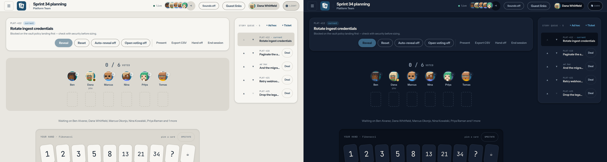

import VerifiedStamp from "../../../components/VerifiedStamp.astro";
import Capability from "../../../components/Capability.astro";

<VerifiedStamp source={["web/src/lib/ui.tsx", "web/src/lib/theme.ts", "web/src/tokens.css"]} />

Parley has three theme states, not two: **light**, **dark**, and **system**,
which follows the operating system and changes with it. System is the default,
and the choice is stored in the browser under `parley:theme`.



The palette is chart paper and navy ink in light, and a night-watch navy in dark.
Numerals are set in a monospace face with tabular figures throughout, because a
vote count is data and should line up in a column.

Reduced-motion preferences are respected: the card flip and the countdown ring
stop animating when the operating system asks them to.

## Theme packs

A **theme pack** is the plugin tier that executes nothing. It is a JSON value
map — never CSS text — so installing one carries roughly the risk of changing a
setting. Parley ships one first-party pack, **Beacon**
(`web/src/themes/beacon.theme.json`), a higher-contrast reading of the same
palette.

```json
{
  "manifest": 1,
  "kind": "theme",
  "id": "parley.beacon",
  "name": "Beacon",
  "version": "1.0.0",
  "modes": {
    "light": { "felt": "#EFEEE9", "ink": "#0A0F16", "...": "all sixteen tokens" },
    "dark":  { "felt": "#070C14", "ink": "#F2F1EC", "...": "all sixteen tokens" }
  }
}
```

### What a pack may set

The sixteen colour tokens, and nothing else: `felt`, `felt-deep`, `surface`,
`surface-hi`, `ink`, `ink-soft`, `ink-faint`, `line`, `line-strong`, `accent`,
`accent-ink`, `accent-soft`, `brass`, `settled`, `go`, `stop`. Every one of them
is required in every mode the pack declares; a mode it does not declare falls
back to the built-in palette.

- **Values are literals.** `#rrggbb` and nothing else. `var()`, `url()`, `env()`,
  `attr()`, `!important` and CSS punctuation are all rejected, so a selector or a
  `url()` beacon has nowhere to be smuggled in.
- **Motion is not themeable.** Durations, easings and the reduced-motion rules
  are not in the contract, so a pack cannot fight a reduced-motion preference.
- **The card faces are not themeable** — `card-back` and `pip` are artwork.

The host applies a pack by iterating those known keys and setting a custom
property on the document; author text is never concatenated into a stylesheet.
Because the properties land on top of `tokens.css`, every existing utility
re-themes with no component changes, and removing a pack restores the built-in
palette immediately, with no reload.

The installed pack itself is stored separately from the light/dark/system
choice, under `parley:theme-pack`; clearing that key uninstalls it.

### The contrast gate

A pack is measured against the pairs the interface actually renders, at the
WCAG 2.2 AA level each role requires — body text (`ink`, `ink-soft`,
`ink-faint`, and `accent-ink` on `accent` and on `brass`) at 4.5:1, and the
non-text roles (`line-strong`, `accent`, `go`, `stop`, `settled` on each of the
four grounds) at 3:1. A pack that fails is refused unless the failure is
acknowledged explicitly, and an installed pack can always be removed.

Ungated, and named rather than implied safe: `line` (a hairline divider — the
control boundary is `line-strong`, which *is* gated), `ink` on `brass` (brass is
a ground for `accent-ink`, never for `ink`), the untheme-able card artwork, and
colour-blind separability — a ratio cannot see hue, so a pack can pass every
pair and still make `go` and `stop` the same colour to a viewer with
deuteranopia.

## What is not here

<Capability rows={[
  { name: "A screen for installing a theme pack", status: "not-built", detail: "The manifest, validation, contrast gate and application pipeline are in place; the operator surface that installs a pack and resets to the built-in palette is still to come." },
  { name: "A verified mobile layout", status: "not-built", detail: "The layout is responsive but has never been formally tested on a handset. Use a tablet or a laptop for a session you care about." },
  { name: "A per-space theme", status: "out-of-scope", detail: "The theme is a reader preference, not a property of a room." },
]} />
